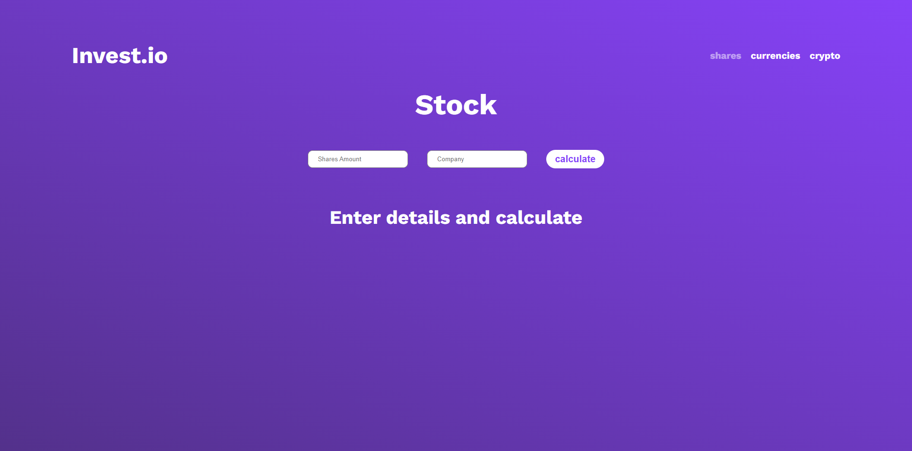

# <span>Invest.io</span>

This is <span>Invest.io</span> a website where you can check value of your investments.

## [Link to page](http://invest.io)



## 🚀 Quick Start

1. Get free API keys at [currencybeacon.com](https://currencybeacon.com/) for currencies and at [twelvedata.com](https://twelvedata.com/) for shares.
2. Clone the repo

```
git clone https://github.com/synonim789/invest-io.git
```

3. Install NPM packages

```
npm install
```

4. Create .env.local file and this api keys like this:

```
SHARES_API_KEY=key from twelvedata
CURRENCY_API_KEY=key from currencybeacon
```

5. Run the App

```
npm run dev
```

6. The app will open at http://localhost:3000
